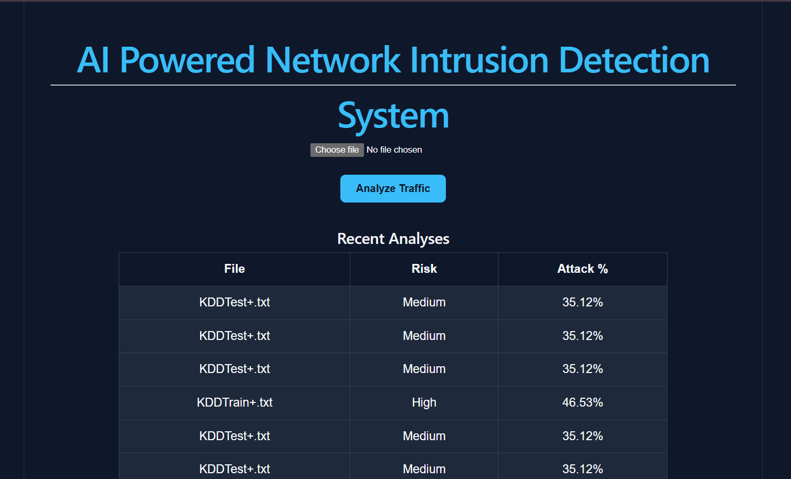
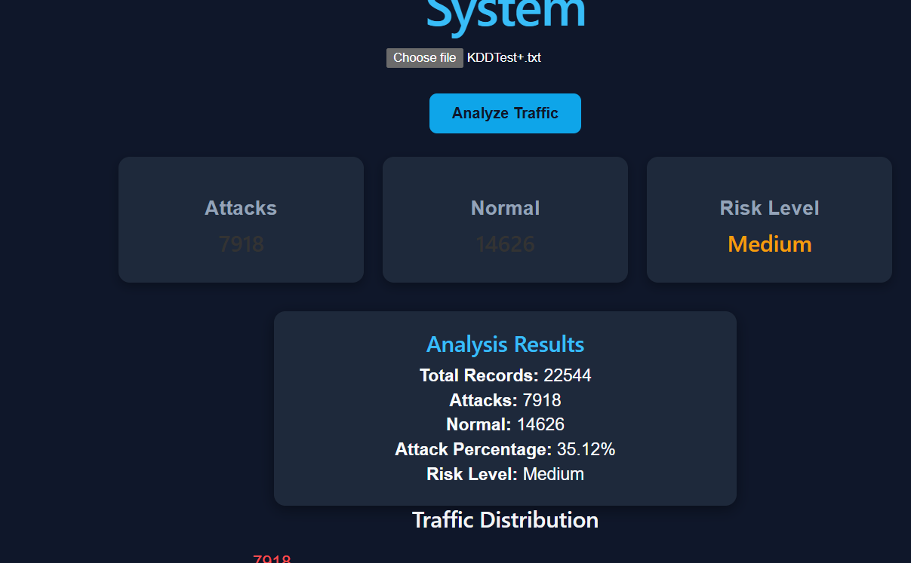
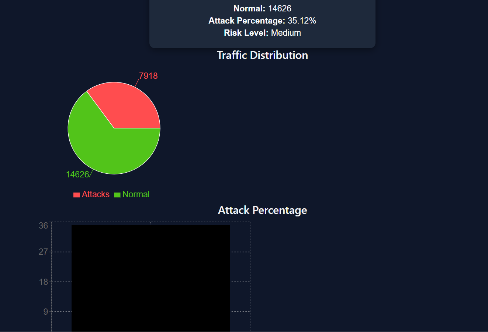

# 🛡️ AI-Powered Network Intrusion Detection System (NIDS)



An AI-driven Network Intrusion Detection System that analyzes network traffic and detects malicious activity using Machine Learning. The system provides real-time traffic analysis, attack statistics, risk assessment, historical scan tracking, PDF report generation, and an interactive cybersecurity dashboard.

---

## 🚀 Live Demo

### Frontend
https://YOUR-VERCEL-URL.vercel.app

### Backend API
https://nids-9si4.onrender.com

### API Documentation
https://nids-9si4.onrender.com/docs

---

## 📸 Screenshots

### Dashboard


### Analysis Results



### Scan History



---

## ✨ Features

### 🤖 Machine Learning Intrusion Detection

- Trained on the NSL-KDD Dataset
- Random Forest Classifier
- Detects malicious network traffic
- Binary Classification:
  - Normal Traffic
  - Attack Traffic

### 📁 CSV-Based Traffic Analysis

- Upload network traffic datasets
- Automatic preprocessing
- Real-time attack detection
- Risk assessment generation

### 📊 Interactive Dashboard

- Attack Statistics
- Normal Traffic Statistics
- Risk Level Assessment
- Pie Chart Visualization
- Attack Percentage Analysis
- Modern Cybersecurity UI

### 🗄️ Cloud-Based Scan History

- MongoDB Atlas Integration
- Persistent Scan Storage
- Historical Analysis Tracking
- Recent Analysis Dashboard

### 📄 PDF Report Generation

Generate downloadable PDF reports containing:

- File Name
- Total Records
- Attack Count
- Normal Count
- Attack Percentage
- Risk Level

### ☁️ Cloud Deployment

- Frontend deployed on Vercel
- Backend deployed on Render
- Database hosted on MongoDB Atlas

---

## 🏗️ System Architecture

```text
User Uploads CSV
        │
        ▼
 React Frontend
        │
        ▼
 FastAPI Backend
        │
        ▼
 Data Preprocessing
        │
        ▼
 Random Forest Model
        │
        ▼
 Intrusion Detection
        │
 ┌──────┴──────┐
 ▼             ▼
MongoDB      PDF Report
 Atlas       Generation
```

---

## 🧠 Machine Learning Pipeline

### Dataset

- NSL-KDD Dataset

### Data Preprocessing

- Added NSL-KDD column names
- Label Conversion:
  - normal → 0
  - attack → 1
- One-Hot Encoding:
  - protocol_type
  - service
  - flag
- Feature Alignment using:

```python
df = df.reindex(columns=features, fill_value=0)
```

### Model

- Random Forest Classifier

### Evaluation Metrics

- Accuracy Score
- Confusion Matrix
- Classification Report

---

## 📈 Risk Assessment Logic

| Attack Percentage | Risk Level |
| ----------------- | ---------- |
| < 10%             | Low        |
| 10% - 40%         | Medium     |
| > 40%             | High       |

---

## 🛠️ Tech Stack

### Frontend

- React.js
- Vite
- Axios
- Recharts
- CSS3

### Backend

- FastAPI
- Pandas
- NumPy
- Joblib
- Pydantic

### Machine Learning

- Scikit-Learn
- Random Forest

### Database

- MongoDB Atlas

### Deployment

- Render
- Vercel

### Version Control

- Git
- GitHub

---

## 📂 Project Structure

```text
nids-project/
│
├── backend/
│   ├── main.py
│   ├── requirements.txt
│   ├── random_forest.pkl
│   ├── features.pkl
│   └── .env
│
├── frontend/
│   ├── src/
│   │   ├── components/
│   │   ├── App.jsx
│   │   └── main.jsx
│   │
│   ├── public/
│   ├── package.json
│   └── vite.config.js
│
├── screenshots/
│   ├── dashboard.png
│   ├── analysis.png
│   ├── history.png
│   └── pdf-report.png
│
├── data/
│   ├── KDDTrain+.txt
│   └── KDDTest+.txt
│
└── README.md
```

---

## ⚙️ Installation & Setup

### Clone Repository

```bash
git clone https://github.com/Aradhana2602/nids.git

cd nids
```

---

### Backend Setup

```bash
cd backend

python -m venv .venv
```

Activate Environment

Windows:

```bash
.venv\Scripts\activate
```

Install Dependencies

```bash
pip install -r requirements.txt
```

Run FastAPI Server

```bash
uvicorn main:app --reload
```

---

### Frontend Setup

```bash
cd frontend

npm install
```

Run Frontend

```bash
npm run dev
```

---

## 🌐 API Endpoints

| Method | Endpoint | Description |
|----------|----------|-------------|
| GET | / | Health Check |
| POST | /predict | Single Prediction |
| POST | /upload-csv | Analyze CSV Dataset |
| GET | /history | Retrieve Scan History |
| POST | /generate-report | Download PDF Report |

---

## 📊 Sample Output

```json
{
  "filename": "KDDTest+.txt",
  "total_records": 22544,
  "attacks": 7918,
  "normal": 14626,
  "attack_percentage": 35.12,
  "risk_level": "Medium"
}
```

---

## 🔒 Security Improvements

- Environment Variables using `.env`
- MongoDB Credentials Removed from Source Code
- `.gitignore` Configured
- Atlas Network Access Configuration
- Cloud Database Authentication

---

## 🎯 Future Enhancements

- SHAP Explainability
- Deep Learning Models
- Real-Time Packet Capture
- Live Network Monitoring
- Email Alert System
- Authentication & User Accounts
- Attack Type Classification
- SIEM Integration

---

## 👩‍💻 Author

### Aradhana Kumari

BE Computer Engineering  
Army Institute of Technology, Pune

GitHub:
https://github.com/Aradhana2602


---

## ⭐ Support

If you found this project useful:

⭐ Star the repository

🍴 Fork the repository

🛠️ Contribute to the project

---

> Built with Machine Learning, FastAPI, React, MongoDB Atlas, Render, and Vercel.
